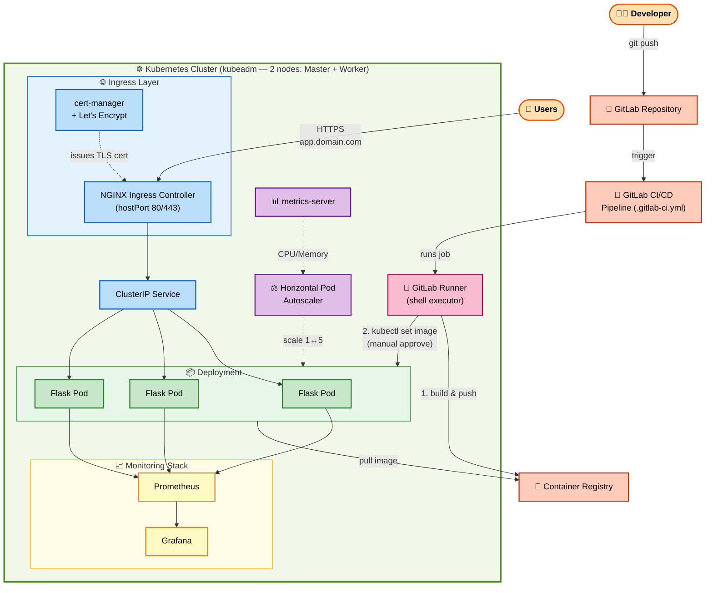

<strong>📑 Table of Contents (click to expand)</strong>

- 📌 [Introduction](#introduction)
- 🏗️ [Architecture Overview](#architecture-overview)
- 🛠️ [Technologies Used](#technologies-used)
- 🎬 [Demo Videos](#demo-videos)
- ✅ [1. 2-Node Cluster Ready](#step-1)
- 🔒 [2. Valid HTTPS Certificate](#step-2)
- 📈 [3. HPA Auto-scaling Pods based on CPU Load](#step-3)
- 🚀 [4. Successful GitLab CI/CD Pipeline](#step-4)
- 📊 [5. Monitoring with Grafana + Prometheus](#step-5)
- 🌐 [6. Live Web Demo Interface](#step-6)
- 🔄 [7. Self-healing on Node Failure](#step-7)
- 🔮 [Future Production Improvements](#future-production-improvements)
- 👤 [Author](#author)

<h2 id="introduction">📌 Introduction</h2>

This project models a complete 2-node Kubernetes cluster (master + worker) deployed using kubeadm. It features **auto-scaling** based on real-time CPU load and **self-healing** capabilities in case of node failures. The entire build & deploy workflow is automated via a GitLab CI/CD pipeline, accessible through a custom domain with HTTPS, and monitored in real-time using Prometheus + Grafana.

<h2 id="architecture-overview">🏗️ Architecture Overview</h2>

<h2 id="technologies-used">🛠️ Technologies Used</h2>

| Component | Technology |
|---|---|
| Container Orchestration | Kubernetes (kubeadm), Calico (CNI) |
| Containerization | Docker |
| Package Manager | Helm |
| Reverse Proxy / Ingress | nginx-ingress |
| Automatic HTTPS | cert-manager + Let's Encrypt |
| Domain / DNS | Custom Domain, A record routing |
| Monitoring | Prometheus, Grafana, kube-state-metrics, node-exporter |
| CI/CD | GitLab CI/CD |
| Load Testing | k6 |
| Demo Application | Python (Flask) |

<h2 id="demo-videos">🎬 Demo Videos</h2>

- HPA Auto-scaling: https://youtu.be/vFYXPUYhfiA
- Self-healing (cordon/drain): https://youtu.be/7viwdsLyjOA

<h2 id="step-1">✅ 1. 2-Node Cluster Ready</h2>

<h2 id="step-2">🔒 2. Valid HTTPS Certificate</h2>

<h2 id="step-3">📈 3. HPA Auto-scaling Pods based on CPU Load</h2>

<h2 id="step-4">🚀 4. Successful GitLab CI/CD Pipeline</h2>

<h2 id="step-5">📊 5. Monitoring with Grafana + Prometheus</h2>

<h2 id="step-6">🌐 6. Live Web Demo Interface</h2>

<h2 id="step-7">🔄 7. Self-healing on Node Failure</h2>

Isolate the worker node (marking it as unschedulable):

Evict all pods from the worker node:

Restore the worker node after the demo:

<h2 id="future-production-improvements">🔮 Future Production Improvements</h2>

This project was built for educational and demonstration purposes to showcase the core concepts of Kubernetes (auto-scaling, self-healing, CI/CD, monitoring). If deploying to a production environment, I recognize the need to implement:

- **Control Plane High Availability**: Currently, there is only 1 master node — a multi-master setup is required to avoid a single point of failure.
- **Backup & Disaster Recovery**: Implement periodic backups for etcd.
- **Optimize Resource Requests/Limits**: Adjust CPU/Memory limits closer to actual usage measured via Grafana to avoid resource waste or shortages.
- **Network Policy & RBAC**: Restrict traffic between namespaces and enforce fine-grained access control.
- **Secret Management**: Utilize Vault or Sealed Secrets instead of the default Kubernetes Secrets.
- **Multi-node Worker**: Scale out with more worker nodes to handle higher loads and avoid dependency on a single node.

<h2 id="author">👤 Author</h2>

**Doan Minh Hiep**

- GitHub: [@minhhiep05](https://github.com/minhhiep05)
- GitLab: [@doanhiep169](https://gitlab.com/doanhiep169)
- Email: doanhiep169@gmail.com
