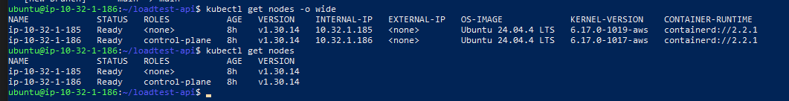
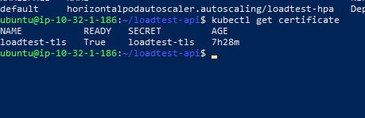
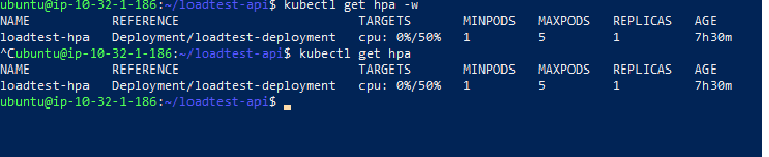
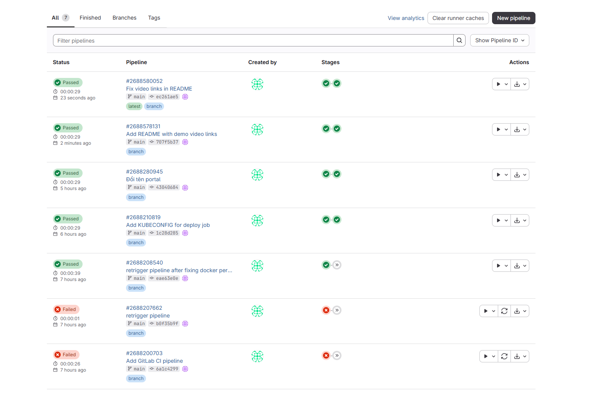
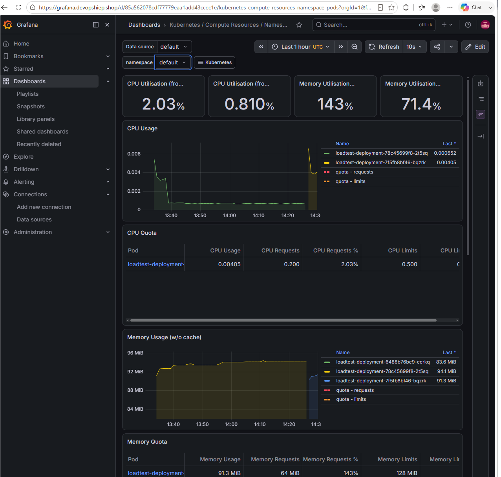
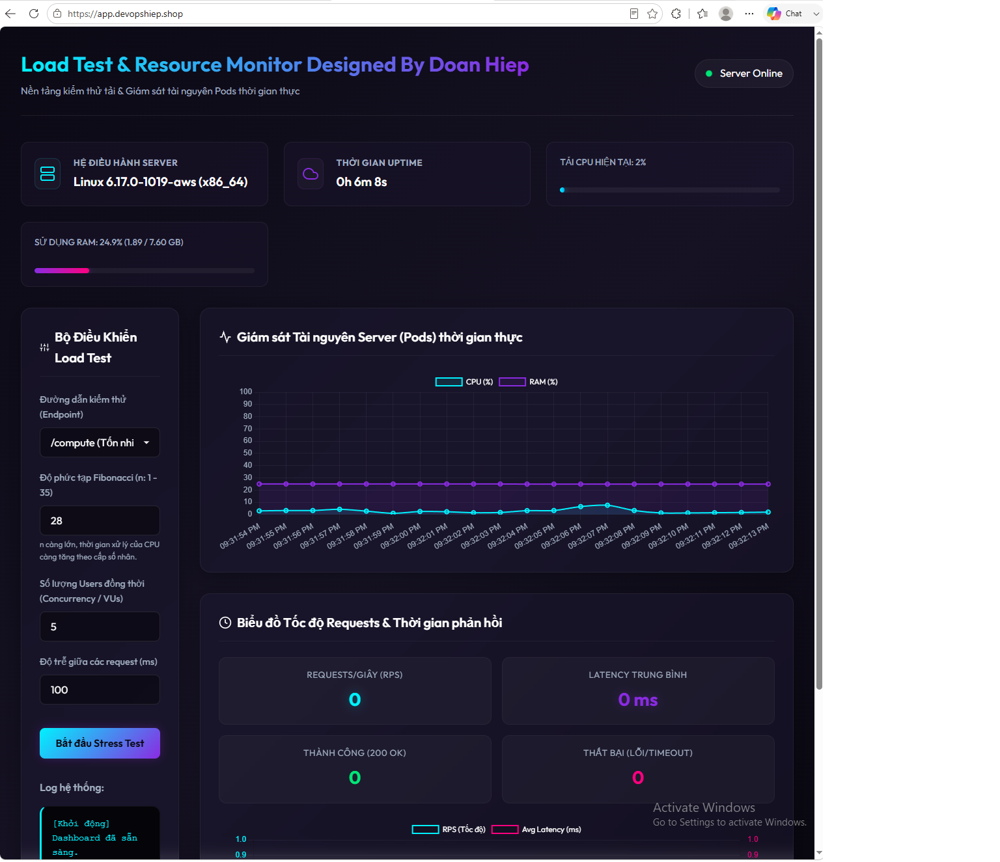
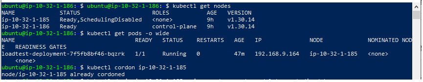
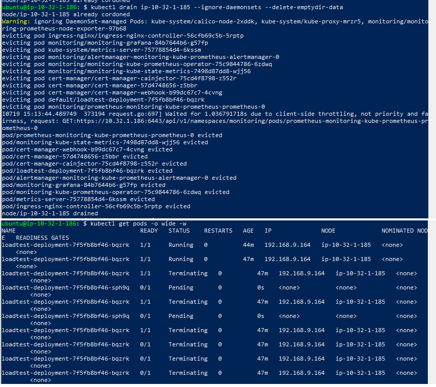
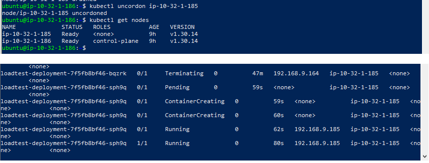

## Giới thiệu

Dự án mô phỏng một hệ thống Kubernetes hoàn chỉnh gồm 2 node (master + worker), triển khai bằng kubeadm, có khả năng **tự động mở rộng (auto-scaling)** theo tải CPU thực tế và **tự phục hồi (self-healing)** khi node gặp sự cố. Toàn bộ quy trình build & deploy được tự động hóa qua GitLab CI/CD, truy cập qua domain riêng với HTTPS, và giám sát real-time bằng Prometheus + Grafana.

## Kiến trúc tổng quan:
Người dùng
│
▼
HTTPS (nginx-ingress + cert-manager)
│
▼
Service (ClusterIP)
│
▼
Pod (Flask app) ←── HPA tự động scale theo % CPU
│
▼
Prometheus (scrape metrics) ──▶ Grafana (dashboard giám sát)

## Demo Video
- HPA Auto-scaling: https://youtu.be/vFYXPUYhfiA
- Self-healing (cordon/drain): https://youtu.be/7viwdsLyjOA

### 1. Cluster 2 node Ready

### 2. HTTPS Certificate hợp lệ

### 3. HPA tự động scale Pod theo tải CPU

### 4. GitLab CI/CD Pipeline chạy thành công

### 5. Giám sát bằng Grafana + Prometheus

### 6. Giao diện Web Demo trực tiếp

## 7. Self-healing khi node gặp sự cố

Cô lập node worker (đánh dấu không nhận pod mới):

Trục xuất toàn bộ pod ra khỏi worker:

Khôi phục lại worker sau khi demo xong:

